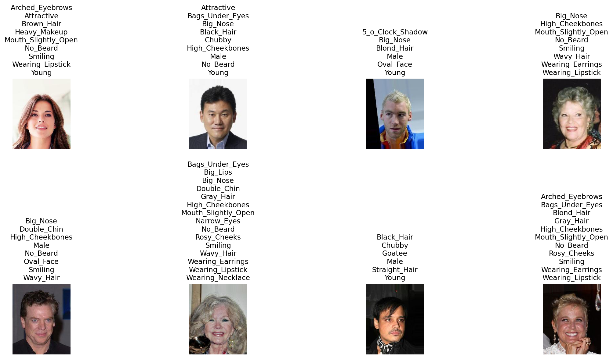

# vlm-bias-decomposition

VLM bias mitigation via vector decomposition in CLIP

## Requirements

```bash
conda init #(if you haven't done this before)

conda create -n clipenv python=3.8 --yes
conda activate clipenv

conda install --yes -c pytorch pytorch=1.7.1 torchvision cudatoolkit=11.0
pip install ftfy regex tqdm pandas matplotlib requests gdown scipy scikit-learn seaborn adjustText
pip install git+https://github.com/openai/CLIP.git
```


## Usage

1. First run `python celeba_downloader_clip_test.py` to ensure you have the CelebA dataset downloaded and CLIP model loaded.
2. Then run `python distinct_prompt_evaluation.py` to perform the CLIP Attribute Detection and Correlation Analysis.


### Nvidia CUDA

Repository is setup for usage with a CUDA which requires a Nvidia GPU, but will work on CPU as well (But a lot slower!). 
Eg. running both scripts with 10000 and 100000 samples respectively on a 8 year old Nvidia GTX 1080 with 8GB VRAM took less than 10 minutes in total.
The same scripts on my laptop(i7 8650u) would take over 4 hours with CPU processing, which is ~25x slower.
So please decrease the `NUM_SAMPLES` at the top of each script to get a more reasonable run time if you don't have a Nvidia GPU.

### celeba_downloader_clip_test.py




running `./celeba_downloader_clip_test.py` gives us: 
```
Using device: cuda
Loading CLIP model...
CelebA Dataset + CLIP Analysis
==================================================
Loading CelebA dataset...
Files already downloaded and verified
✓ Successfully loaded CelebA dataset with 162770 images

==================================================
CELEBA DATASET EXPLORATION
==================================================
Total number of images: 162770
Number of attributes: 40

Analyzing attributes distribution...
Sampling attributes: 100%|████████████████████████████████████████████████████████████████████████████| 162770/162770 [01:40<00:00, 1626.66it/s]

 Attributes and how frequent they are:
          Attribute    Count  Percentage
           No_Beard 135779.0   83.41
              Young 126788.0   77.89
         Attractive  83603.0   51.36
Mouth_Slightly_Open  78486.0   48.21
            Smiling  78080.0   47.96
   Wearing_Lipstick  76437.0   46.96
    High_Cheekbones  73645.0   45.24
               Male  68261.0   41.93
       Heavy_Makeup  62555.0   38.43
          Wavy_Hair  51982.0   31.93
          Oval_Face  46101.0   28.32
        Pointy_Nose  44846.0   27.55
    Arched_Eyebrows  43278.0   26.58
           Big_Lips  39213.0   24.09
         Black_Hair  38906.0   23.90
           Big_Nose  38341.0   23.55
      Straight_Hair  33947.0   20.85
    Bags_Under_Eyes  33280.0   20.44
         Brown_Hair  33192.0   20.39
   Wearing_Earrings  30362.0   18.65
              Bangs  24685.0   15.16
         Blond_Hair  24267.0   14.90
     Bushy_Eyebrows  23386.0   14.36
   Wearing_Necklace  19764.0   12.14
        Narrow_Eyes  18869.0   11.59
   5_o_Clock_Shadow  18177.0   11.16
  Receding_Hairline  13040.0    8.01
    Wearing_Necktie  11890.0    7.30
        Rosy_Cheeks  10525.0    6.46
         Eyeglasses  10521.0    6.46
             Goatee  10337.0    6.35
             Chubby   9389.0    5.76
          Sideburns   9156.0    5.62
             Blurry   8362.0    5.13
        Wearing_Hat   8039.0    4.93
        Double_Chin   7571.0    4.65
          Pale_Skin   7005.0    4.30
          Gray_Hair   6896.0    4.23
           Mustache   6642.0    4.08
               Bald   3713.0    2.28

Visualizing 8 sample images...

Running CLIP analysis on 162770 images...
Processing batches: 100%|█████████████████████████████████████████████████████████████████████████████████████| 636/636 [06:26<00:00,  1.64it/s]

Analyzing CLIP results...

Average CLIP confidences by text prompt:
a photo of a woman with makeup: 0.213
a photo of a woman smiling: 0.209
a photo of a man with a receding hairline: 0.198
a photo of a woman with blonde hair: 0.173
a photo of an attractive man: 0.130
a photo of a man with glasses: 0.077

Correlation analysis:
Male images - average 'man' prompts confidence: 0.167
Female images - average 'woman' prompts confidence: 0.330
Images with glasses - 'glasses' prompts confidence: 0.593
Images without glasses - 'glasses' prompts confidence: 0.042
Images with receding hairline - 'receding hairline' confidence: 0.431
Images without receding hairline - 'receding hairline' confidence: 0.177
Attractive images - 'attractive' prompts confidence: 0.106
Non-attractive images - 'attractive' prompts confidence: 0.154
Smiling images - 'smiling' prompts confidence: 0.347
Non-smiling images - 'smiling' prompts confidence: 0.081
Heavy makeup images - 'makeup' prompts confidence: 0.380
No heavy makeup images - 'makeup' prompts confidence: 0.109
Blonde hair images - 'blonde hair' confidence: 0.714
Non-blonde hair images - 'blonde hair' confidence: 0.079

Analysis complete!
Check 'celeba_samples.png' for sample images visualization
python3 celeba_downloader_clip_test.py  1568.52s user 95.02s system 332% cpu 8:21.06 total
```


### distinct_prompt_evaluation.py

```

Using device: cuda
Loading CLIP model...
Loading CelebA dataset...
Files already downloaded and verified
✓ Successfully loaded CelebA dataset with 162770 images

Dataset loaded with 162770 images
Number of attributes: 40
Attributes: 5_o_Clock_Shadow, Arched_Eyebrows, Attractive, Bags_Under_Eyes, Bald, Bangs, Big_Lips, Big_Nose, Black_Hair, Blond_Hair...

============================================================================
IMPROVED CLIP ANALYSIS WITH BINARY COMPARISONS
============================================================================

Running improved CLIP analysis on 100000 images (batch size: 256, num_workers: 16, prefetch_factor: 2)...
Processing batches: 100%|█████████████████████████████████████████████████████████████████████████████████████| 391/391 [05:20<00:00,  1.22it/s]

Improved CLIP Analysis Results:

Gender Classification Accuracy:
Male accuracy: 41173/41991 = 98.1%
Female accuracy: 57749/58009 = 99.6%

Attribute Detection Performance:

Metrics:
- Avg Score (Has): How confident CLIP is when the attribute is present (higher is better)
- Avg Score (Has not): How confident CLIP is when attribute is absent (lower is better)
- Discrimination: Difference between the two (positive = CLIP can detect this attribute)

Attribute            | Avg Score (Has) | Avg Score (Has not) | Discrimination
----------------------------------------------------------------------------
male                 |           0.945 |               0.033 |         +0.912
blond_hair           |           0.917 |               0.264 |         +0.653
bald                 |           0.658 |               0.063 |         +0.595
eyeglasses           |           0.785 |               0.214 |         +0.571
smiling              |           0.604 |               0.159 |         +0.445
pale_skin            |           0.684 |               0.318 |         +0.366
bangs                |           0.617 |               0.268 |         +0.349
young                |           0.759 |               0.414 |         +0.345
wearing_hat          |           0.778 |               0.474 |         +0.304
black_hair           |           0.677 |               0.419 |         +0.257
gray_hair            |           0.489 |               0.278 |         +0.211
wavy_hair            |           0.647 |               0.459 |         +0.187
heavy_makeup         |           0.585 |               0.400 |         +0.185
bushy_eyebrows       |           0.555 |               0.379 |         +0.176
straight_hair        |           0.915 |               0.763 |         +0.152
chubby               |           0.574 |               0.438 |         +0.136
blurry               |           0.367 |               0.233 |         +0.134
brown_hair           |           0.774 |               0.659 |         +0.115
mustache             |           0.353 |               0.253 |         +0.100
wearing_lipstick     |           0.718 |               0.636 |         +0.082
wearing_necktie      |           0.688 |               0.607 |         +0.082
wearing_earrings     |           0.712 |               0.635 |         +0.077
arched_eyebrows      |           0.742 |               0.671 |         +0.071
double_chin          |           0.669 |               0.605 |         +0.064
attractive           |           0.345 |               0.286 |         +0.060
narrow_eyes          |           0.641 |               0.588 |         +0.053
bags_under_eyes      |           0.573 |               0.554 |         +0.019
mouth_slightly_open  |           0.580 |               0.562 |         +0.018
pointy_nose          |           0.291 |               0.283 |         +0.009
big_lips             |           0.234 |               0.228 |         +0.006
oval_face            |           0.561 |               0.557 |         +0.004
big_nose             |           0.307 |               0.306 |         +0.002
wearing_necklace     |           0.645 |               0.653 |         -0.008
high_cheekbones      |           0.368 |               0.384 |         -0.015
receding_hairline    |           0.553 |               0.573 |         -0.020
sideburns            |           0.510 |               0.547 |         -0.037
goatee               |           0.453 |               0.521 |         -0.068
rosy_cheeks          |           0.227 |               0.302 |         -0.075
no_beard             |           0.742 |               0.838 |         -0.097
5_o_clock_shadow     |           0.182 |               0.490 |         -0.309

Interesting Cases:

============================================================================
EMBEDDING SPACE CORRELATION ANALYSIS
============================================================================

Computing embedding similarities for 100000 images...

CLIP-CelebA Attribute Correlations:

Metrics:
- Correlation: How well CLIP's similarity scores align with CelebA labels (-1 to +1, higher (absolute) magnitude = better)
- Mean Sim (WITH): Average cosine similarity (dot product of normalized embeddings) between images WITH the attribute and its text description
- Mean Sim (WITHOUT): Average cosine similarity between images WITHOUT the attribute and its text description
- Higher correlation means CLIP understands this attribute; larger gap between WITH/WITHOUT is better

Attribute            |  Correlation | Mean Sim (WITH) |  Mean Sim (WITHOUT)
----------------------------------------------------------------------------
Smiling              |        0.640 |           0.241 |               0.220
Blond_Hair           |        0.554 |           0.252 |               0.222
Bangs                |        0.519 |           0.238 |               0.211
No_Beard             |       -0.514 |           0.210 |               0.230
Heavy_Makeup         |        0.501 |           0.227 |               0.211
Wearing_Hat          |        0.441 |           0.255 |               0.225
Black_Hair           |        0.406 |           0.233 |               0.216
Wavy_Hair            |        0.397 |           0.235 |               0.220
Goatee               |        0.393 |           0.245 |               0.218
Eyeglasses           |        0.392 |           0.232 |               0.206
Wearing_Earrings     |        0.389 |           0.246 |               0.232
Wearing_Lipstick     |        0.378 |           0.222 |               0.211
Wearing_Necktie      |        0.339 |           0.240 |               0.222
Brown_Hair           |        0.337 |           0.245 |               0.231
Arched_Eyebrows      |        0.295 |           0.250 |               0.240
Bald                 |        0.290 |           0.245 |               0.210
Mouth_Slightly_Open  |        0.265 |           0.235 |               0.228
Receding_Hairline    |        0.243 |           0.246 |               0.229
Mustache             |        0.232 |           0.230 |               0.213
Young                |        0.218 |           0.225 |               0.221
Blurry               |        0.214 |           0.229 |               0.217
Attractive           |        0.191 |           0.212 |               0.207
Bushy_Eyebrows       |        0.187 |           0.242 |               0.235
Pale_Skin            |        0.177 |           0.226 |               0.211
Gray_Hair            |        0.167 |           0.234 |               0.221
Straight_Hair        |        0.128 |           0.230 |               0.224
Oval_Face            |        0.111 |           0.242 |               0.240
Wearing_Necklace     |        0.105 |           0.233 |               0.229
5_o_Clock_Shadow     |        0.102 |           0.224 |               0.221
Sideburns            |        0.086 |           0.230 |               0.225
Big_Lips             |        0.078 |           0.222 |               0.220
Bags_Under_Eyes      |       -0.076 |           0.233 |               0.235
Pointy_Nose          |        0.069 |           0.230 |               0.228
Chubby               |        0.054 |           0.210 |               0.206
High_Cheekbones      |       -0.025 |           0.212 |               0.214
Big_Nose             |       -0.022 |           0.226 |               0.227
Double_Chin          |        0.021 |           0.214 |               0.212
Male                 |       -0.012 |           0.224 |               0.224
Narrow_Eyes          |        0.005 |           0.227 |               0.227
Rosy_Cheeks          |        0.005 |           0.220 |               0.220

Saving analysis results...
Analysis complete! Results saved to 'clip_celeba_improved_results.json'

python3 distinct_prompt_evaluation.py  1087.39s user 164.20s system 216% cpu 9:38.30 total
```
